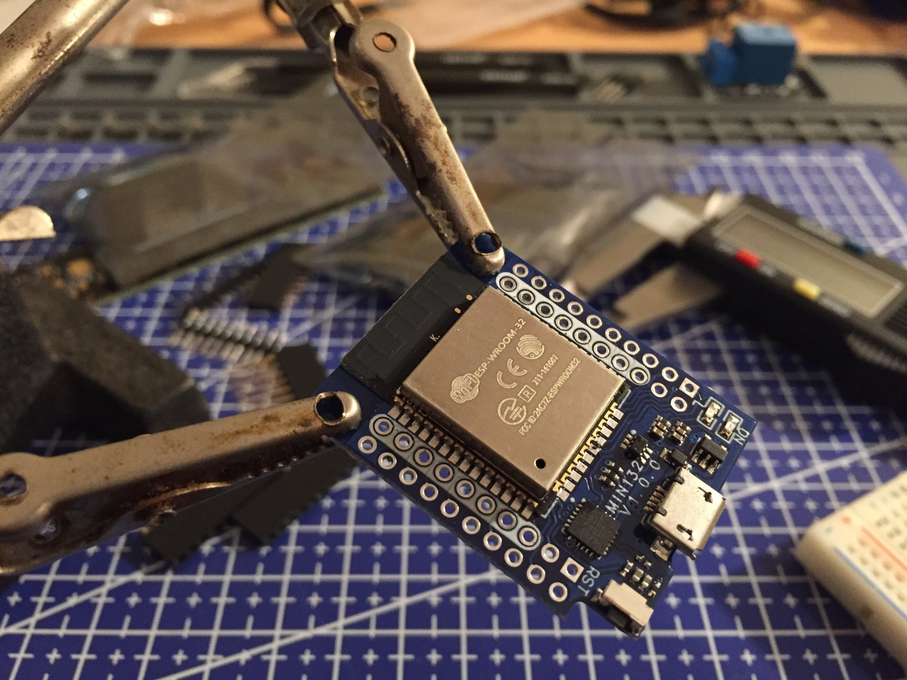
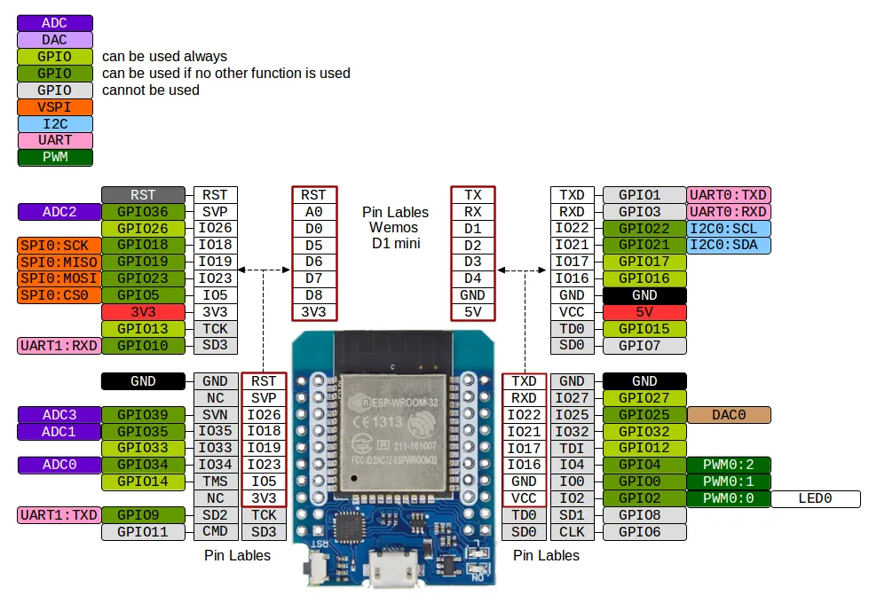

# Wemos D1 Mini ESP32

The [Wemos D1 Mini](https://www.wemos.cc/en/latest/d1/d1_mini.html) is a popular ESP8266 development module in a small form factor. The D1 Mini ESP32 is a generic ESP32 development module that is _not_ created by Wemos, but has a similar footprint to allow interfacing with shields designed for the origin D1 Mini.

In [PlatformIO](https://platformio.org), the board is configured as "[WeMos D1 MINI ESP32](https://docs.platformio.org/en/latest/boards/espressif32/wemos_d1_mini32.html)"

The board features two rows of headers, the inner of the two have a white silkscreen border and indicates the pinout of the original D1 Mini onto which sockets can be soldered to interface with shields. The outer of the two rows has a unique pinout for the ESP32 and its upgraded features.

These can be purchased through several Chinese manufactures and reseller through online marketplaces.

